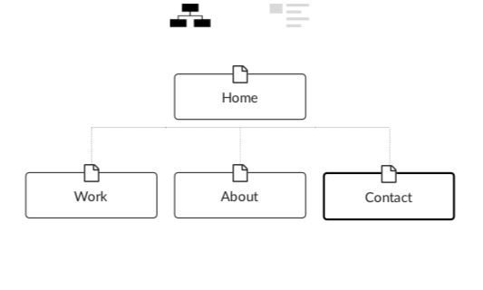

## Term 1 Portfolio Project

# Ivan Donato - Portfolio

This is my portfolio website written in HTML and CSS for our Term 1 Assessment at Coder Academy. 

I enjoyed designing and executing the website and am hopeful that it displays not only my relevant skills in HTML and CSS, but also provide a glimpse into my personality as well.

Portfolio URL: www.donato.dev

Github Repository: https://github.com/donatoivan/portfolio

## Table of Contents
* [Motivation](#motivation)
* [Design Process](#design-process)
  * [Structure & Sitemap](#structure-and-sitemap)
  * [Inspiration](#inspiration)
  * [Colour](#colour)
* [Features](#features)
* [Technical](#technical)
* [Screenshots](#screenshots)
* [Authors](#authors)

## Motivation
As an aspiring developer, this was a great opportunity to be able to demonstrate my knowledge base so far. I've found the course to be incredibly rewarding to this point in time and was very excited to be able to once again put my recently acquired skills to the test.

As much as my motivation would be focused primarily to attract the interest of any future employers, I also sought out to define a design philosophy from the beginning and stick to it as closely as possible until the end. I wanted to do this in order to see out my initial design and not be swayed to include many wonderful things that I may have seen my classmates implement. I wanted to be disciplined and stick to my guns. I thought this would also provide me with a clear understanding on where I might need to improve once I had finished.

## Target Audience
As mentioned above, I obviously am thnking about any future employers that might happen to visit my website in the future. But I am also thinking about providing any future user with a distinct experience while simultaneously sharing a little part of my personality.

## Design Process
I'm a very visual person by nature. Perhaps because of my background in the Performing Arts, but I am also predisposed to "do" before I "plan". This may seem like I frequently throw caution to the wind or fly by the seat of my pants, but this line of thinking is present in all great art forms. As an actor, I found great joy in rigorously learning all the fundamentals I could before I started a project and then letting them sit in my sunconcious while I let my imagination lead me. I wanted to apply this philosophy to my portfolio website. I figured that as I had learnt a decent amount of HTML and CSS theory in the previous week(was it only that long?) and I felt relatively comfortable during that time, I felt that I had a significant structure beneath me in order to improvise with some HTML and CSS. Essentially, I wanted to jazz.

As stated on my portfolio website, I'm incredibly interested in narrative particularly when it comes to the user experience. With this in mind, I wanted each individual section of my website to tell it's own unique story. All theses single elements would then form a whole collective narrative that would form the story of my website.

I wanted to tell a sparse story. I wanted to tell a minimalist story. I wanted to create the look of elegance, convey the efficiency of simplicity and instill the feeling of wonder in the user when they visited my website.

### Structure and Sitemap

It became very clear to me very early why planning is seen as crucial when it comes to building a website. The particularities of HTML and CSS are such that they are proned to snowballing and what was once a simple idea can become quite finicky and complex. I was therefore glad that our teachers enforced us to make use of Figma for planning and design before finalising any code.

I settled on this simple page structure:

I knew from the beginning that I wanted to make my website single-page-scroll. It seemd like the natural thing to implement considering we had mobile and tablet compatibility to consider.

It must be noted that even though Home is seen as the parent page, which it is, the website has a single page structure whereby you can access all other pages from Home. You can also access Home from all the other pages by pressing on a button.
Extending on my philosophy of simplicity, I wanted to make the layout as stripped back as possible.

What became clear to me was that if I wanted to make the structure as simple as possibele, I needed to make my website as dynamic as I could. I loved this idea of having things move as the user scrolls through the page and was keen on implementing this in my page.

I found a library which is driven by CSS called 'Animate On Scroll'. (https://github.com/michalsnik/aos)

It's very similar to Wow.js, a Javascript plugin that reveals elements as you scroll, but I felt that using Wow would be beyond the scope of the assignment. I reasoned that as AOS was css driven, using it would be comparable to using Font Awesome or Bootstrap. It was very helpful in providing some wow(sorry) responses from some text subjects that I showed my website to.

###

