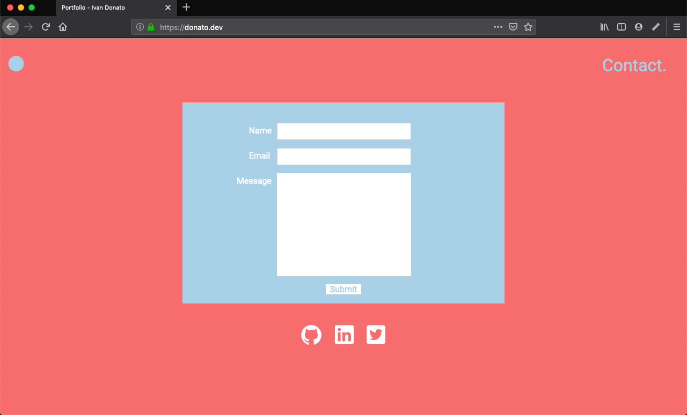

## Term 1 Portfolio Project

# Ivan Donato - Portfolio

This is my portfolio website written in HTML and CSS for our Term 1 Assessment at Coder Academy. 

I enjoyed designing and executing the website and am hopeful that it displays not only my relevant skills in HTML and CSS, but also provide a glimpse into my personality as well.

Portfolio URL: https://www.donato.dev

Github Repository: https://github.com/donatoivan/portfolio

## Table of Contents
* [Motivation](#motivation)
* [Design Process](#design-process)
  * [Structure & Sitemap](#structure-and-sitemap)
  * [Inspiration](#inspiration)
  * [Colour](#colour)
* [Features](#features)
* [Project Management](#project-management)
* [History and Theory Of The Internet](#history-and-theory-of-the-internet)
  * [History and Theory Of The Internet](#history-and-theory-of-the-internet)
  * [Domains, Web Servers, DNS and Web Browsers](#domains-web-servers-dns-and-web-browsers)
  * [Wifi](#wifi)
 

## Motivation
As an aspiring developer, this was a great opportunity to be able to demonstrate my knowledge base so far. I've found the course to be incredibly rewarding to this point in time and was very excited to be able to once again put my recently acquired skills to the test.

As much as my motivation would be focused primarily to attract the interest of any future employers, I also sought out to define a design philosophy from the beginning and stick to it as closely as possible until the end. I wanted to do this in order to see out my initial design and not be swayed to include many wonderful things that I may have seen my classmates implement. I wanted to be disciplined and stick to my guns. I thought this would also provide me with a clear understanding on where I might need to improve once I had finished.

## Target Audience
As mentioned above, I obviously am thnking about any future employers that might happen to visit my website in the future. But I am also thinking about providing any future user with a distinct experience while simultaneously sharing a little part of my personality.

## Design Process
I'm a very visual person by nature. Perhaps because of my background in the Performing Arts, but I am also predisposed to "do" before I "plan". This may seem like I frequently throw caution to the wind or fly by the seat of my pants, but this line of thinking is present in all great art forms. As an actor, I found great joy in rigorously learning all the fundamentals I could before I started a project and then letting them sit in my sunconcious while I let my imagination lead me. I wanted to apply this philosophy to my portfolio website. I figured that as I had learnt a decent amount of HTML and CSS theory in the previous week(was it only that long?) and I felt relatively comfortable during that time, I felt that I had a significant structure beneath me in order to improvise with some HTML and CSS. Essentially, I wanted to jazz.

As stated on my portfolio website, I'm incredibly interested in narrative particularly when it comes to the user experience. With this in mind, I wanted each individual section of my website to tell it's own unique story. All theses single elements would then form a whole collective narrative that would form the story of my website.

I wanted to tell a sparse story. I wanted to tell a minimalist story. I wanted to create the look of elegance, convey the efficiency of simplicity and instill the feeling of wonder in the user when they visited my website.

### Structure and Sitemap

It became very clear to me very early why planning is seen as crucial when it comes to building a website. The particularities of HTML and CSS are such that they are proned to snowballing and what was once a simple idea can become quite finicky and complex. I was therefore glad that our teachers enforced us to make use of Figma for planning and design before finalising any code.

I settled on this simple page structure:

I knew from the beginning that I wanted to make my website single-page-scroll. It seemd like the natural thing to implement considering we had mobile and tablet compatibility to consider.

It must be noted that even though Home is seen as the parent page, which it is, the website has a single page structure whereby you can access all other pages from Home. You can also access Home from all the other pages by pressing on a button.
Extending on my philosophy of simplicity, I wanted to make the layout as stripped back as possible.

### Inspiration

I sourced images for my moodboard that evoked a sense of emptiness and eternity. A lot of the images above also toy with all their main elements being off centre. I liked this enough to want to implement this in my design. Below is my early sketch of my home page using the off centre idea:

My thought was that I wanted a short welcome message to be the hero of the Home page on the bottom left. I wanted the page-section links to be in the top right-hand corner not as noticeable as the welcome message, but still present. I also wanted a home button to be preent on every page. I thought it would be good for this to live in the top-left corner, where most Home button instinctivley live. Thgis home button would alse serve as a great transition for mobile and tablet devices, except i would have the button appear at centre-bottom of these devices. 

I also wanted to explore classic and classy colours. I was drawn more and more to a grey colour palette, possibly because of my fascination with the above images. This was the colours I came to use:

And below is the implementation of both structure and colour on my home page:

It follows that I used this same process to create the remaining three pages. Here they are:

Again, I wanted to play with where I wanted the focus to be on each page, either centre or off-centre. I also wanted each page to be unique but be part of that same story. Using the simple structure and classic colour tones, I wanted to tell the user that the person responsible for the portfolio website was both elegant and contained.

And this is how I optimized the design for mobile and tablet: 

### Colour

But then I kept staring at the grey. And I kept staring and staring and something didn't feel right. When I was able to aritculate what my issue was with the colour palette I had chosen, it all became clear to me; I was leaving out a whole way to communicate with the user. I hadn't explored a whole dimension that I could use to express my self. I was missing colour.

As much as I was seeking elegance and class. I also wanted the user to get the impression that I was fun.
I love fun. I am fun. And the colour grey isn't the best way to communicate that. So I explored colour.

I found this to be a colour palette that I was drawn to but I felt that it was too soft. I needed something a bit more bold. This is what I came around to using:

I loved that some of these colours were bold, and yet the light blue and the yellow were very gentle. This is how I implemented them in my final design.

I was very happy with my change of mind regarding colour.

## Features

What became clear to me was that if I wanted to make the structure as simple as possible, I needed to make my website as dynamic as I could. I loved the idea of having things move as the user scrolls through the pages and was keen on implementing this if I could.

I found a library which is driven by CSS called 'Animate On Scroll'. (https://github.com/michalsnik/aos)

It's very similar to Wow.js, a Javascript plugin that reveals elements as you scroll, but I felt that using Wow would be beyond the scope of the assignment. I reasoned that as AOS was css driven, using it would be comparable to using Font Awesome or Bootstrap. It was very helpful in providing some wow(sorry) responses from some text subjects that I showed my website to.

I used on a few key elements on each page:

On my home page I wanted both the welcome message and the page-links to appear as the user loaded the page. I consciously made the button in the top left stationary. I thought it would be nice if it was a consistent presence on every page.

With my work page, I wanted to have the elements come together towards the centre and then have modal windows pop-up when the user clicked on one of my projects. I used Boostrap4 for the modal windows.

My about me page is my favourite page. Not only does each letter appear and different intervals (which I hardcoded ofr each individual letter), but once the user hovers over the letters, each one of them changes colour individually. As an easter egg, I give people the opportunityto download my performing arts CV in case they don't belive my backstory (which happens a lot). Hovering over the icons representing my skillset also makes them change colour.

The contact page has the form appearing in the centre of the page once the user scrolls down, giving it the focus it deserves and drawiing the user's attention to it.

I should add that all hover elements were removed for both the mobile and tablet versions of my website.

## Project Management

Using Trello really made the management of this project all the easier. The ability to list things that need to be done and then dragging them acroos to the completed section is really satisfying, but also really helpful in determining the order of importance. Here is an example of my trello board halfway thorugh the build:

## History and Theory of the Internet

### History and Theory of the Internet

In 1969, the researchers for DARPA sent the first data packet between systems using ARPANET which eventually evolved to become the modern internet. By the end of 1971, there were 15 different nodes across the US.

In 1971, e-mail was invented and the very next year, transmission control protocol was created which established how data is transferred. By the mid-nineteen-seventies, first international ARPANET connections were made to England and Norway. It was followed by other networks in US departments of Energy and NASA.

More and more networks began to come into the limelight throughout the eighties all across the US. In 1989, Tim Bernes-Lee invented the World Wide Web at the Sun Physics Laboratory in Switzerland. The internet went public in 1990 which provided a standard for computers to interact with each other. First dial-up internet service was launched in Brookline Massachusetts in 1993 followed by the first search engine launch in the same year.

By the end of year 1994, there were 11 million people in the USA using the internet and in 1996, Nokia released the first internet phone. By the year 2000, there were 1,000,000,000 (1 billion) unique web pages. By 2012, there were 1 billion users on Facebook.

### Domains, Web Servers, DNS and Web Browsers

A web browser is software installed on a computer that enables users to browse the web. A web server is a computer which hosts a website.

When we enter a domain name, which is the web address into an internet browser. The browser first translates the domain name into an IP address of a website. The browser checks the computer's cache for DNS records that match the domain name entered.

### Wifi

Wi-Fi technology today is found everywhere, and the means for making it fast and reliable was an Australian invention.
It is the same wireless network technology that allows our phones, computers and other technologies to connect to the internet reliably and at fast speeds.

Today the technology is so widespread there are far, far more Wi-Fi devices than there are human beings; by 2020, there will be an estimated 40 billion devices worldwide. Twenty years ago (on January 23, 1996) CSIRO’s patent for a method of creating a fast and reliable Wireless Local Area Network (WLAN) was approved in the US.

Since then, the CSIRO has made more than $420 million from the invention (not adjusted for inflation), making it the organisation's best performing commercial enterprise.
